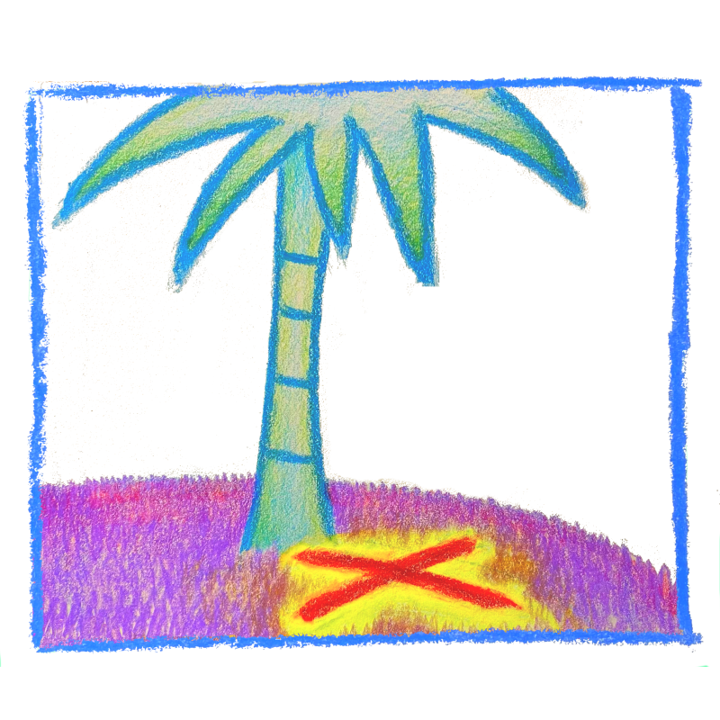

# TreasureTree

A real-world treasure hunt game where the treasures are
represented as QR codes in the physical world,
and NFTs in the virtual.

There are only two actions in the game,
performed by two roles:

- treasure _planters_ physically _plant_ QR codes containing secret keys,
- treasure _claimers_ find and scan those QR codes to _claim_ them on the network, as NFTs.

Each treasure is unique,
and once claimed may not be claimed again.

Each treasure is associated with a picture,
which is intended to be a photograph taken from a phone.
From the photo are extracted the geographic coordinates of the treasure,
such that treasure hunters can view new treasures on the website
and use the coordinates to hunt for them.

This was created as part of the [Solana Season Hackathon][ssh].
See a [demo video here][vid] showing how it is intended to be played,
and the [blog about our experience][blog].

[ssh]: https://github.com/solana-labs/solana-season
[vid]: https://youtu.be/uc2MUdDo4xs
[blog]: https://brson.github.io/2021/06/08/rust-on-solana

See it live at [treasuretree.org],
but note that
**this is prototype-quality software,
and works just enough to demo**.
It runs only against a Solana devnet,
not a live network.

[treasuretree.org]: https://treasuretree.org

## About the software

TreasureTree is architected as a typical server-based web application,
but with a simple data model that is trivially mirrored to the blockchain.
It has this dual centralized/blockchain architecture for two reasons:

- We wanted a responsive and simple user experience that requires no knowledge
  of blockchains or &mdash; especially &mdash; blockchain wallets.
- We wanted to prototype the app quickly without dealing with blockchain programming,
- We wanted to be able to experiment with multiple blockchains while keeping the blockchain
  components isolated from the main logic of the app.

It is written mostly in Rust and consists of several crates:

- [`geonft`]: a [Rocket] web server, serving static pages, a JSON-based API,
  and a WASM blob for use by the client,
- [`geonft_wasm`]: Rust code used by the web app,
- [`geonft_solana`]: a Solana program that implements a similar API
  to the web API,
- [`geonft_sync`]: a bot that synchronizes state between the backend of
  the web app and the blockchain,
- [`geonft_data`]: no-std data types shared between crates,
- [`geonft_nostd`]: no-std code shared between crates, mostly crypto.
- [`geonft_shared`]: std code shared between crates.

(The original name of this project was "geonft").

The split between `geonft_data` and `geonft_nostd` was to work around
now-forgotten problems compiling certain crates for Solana.

[Rocket]: https://rocket.rs

[`geonft`]: src/geonft
[`geonft_wasm`]: src/geonft_wasm
[`geonft_solana`]: src/geonft_solana
[`geonft_sync`]: src/geonft_sync
[`geonft_data`]: src/geonft_data
[`geonft_nostd`]: src/geonft_nostd
[`geonft_shared`]: src/geonft_shared

## Limitations and future work

The code is full of quick hacks and missing cases,
and is in a frankly embarassing shape.

The Solana integration is the barest prototype.
During the hackathon we had to overcome the learning curve,
and ran into problems with several of our
architectural assumptions which have not been fixed yet.

In particular,
the Solana program doesn't actually verify the signatures
necessary to validate the transactions it is executing.
It'll accept most any garbage.
This is because we couldn't do the signature verification
within the on-chain CPU budget.
Fixing this requires some architectural changes.

Geographic coordinates of treasures are not yet displayed on the web app.

Access control for planters is not implemented
in an economically viable way for on-chain activity &mdash;
it would be expensive if many people began planting treasures.

Images are stored on a central server,
but should be pinned to IPFS.
